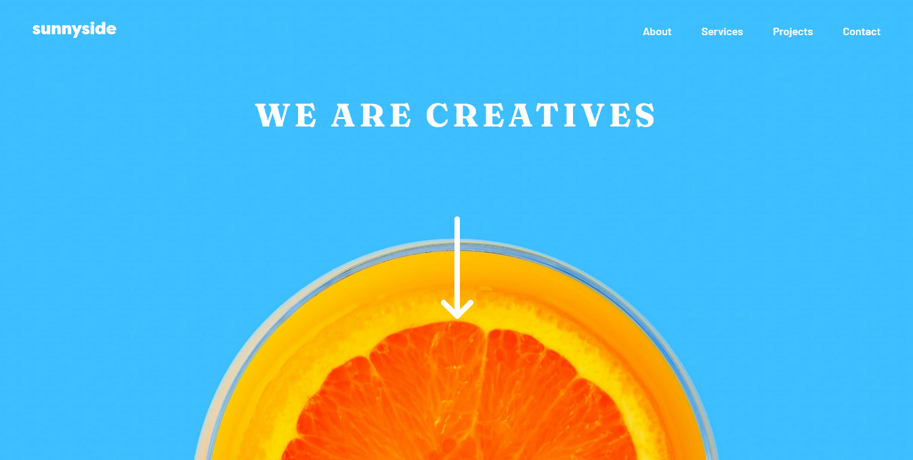

# Frontend Mentor - Sunnyside agency landing page solution

This is a solution to the [Sunnyside agency landing page challenge on Frontend Mentor](https://www.frontendmentor.io/challenges/sunnyside-agency-landing-page-7yVs3B6ef). Frontend Mentor challenges help you improve your coding skills by building realistic projects.

## Table of contents

- [Overview](#overview)
  - [The challenge](#the-challenge)
  - [Screenshot](#screenshot)
  - [Links](#links)
- [My process](#my-process)
  - [Built with](#built-with)
  - [Useful resources](#useful-resources)
- [Author](#author)

## Overview

### The challenge

Users should be able to:

- View the optimal layout for the site depending on their device's screen size
- See hover states for all interactive elements on the page

### Screenshot

### Links

- Solution URL: [Click here]([https://your-solution-url.com](https://github.com/naufalf25/Sunnyside-agency-landing-page))
- Live Site URL: [Click here]([https://your-live-site-url.com](https://naufalf25.github.io/Sunnyside-agency-landing-page/))

## My process

### Built with

- HTML5
- CSS3
- Javascript
- Flexbox
- CSS Grid
- Mobile-first workflow

### Useful resources

- [Stack Overflow](https://stackoverflow.com/) - This helped me for solving my problem to finishing this project.

## Author

- Frontend Mentor - [@naufalf25](https://www.frontendmentor.io/profile/naufalf25)
- Instagram - [@naufal_railfans25](https://www.instagram.com/naufal_railfans25/)
- Linkedin - [Muhammad-Naufal-Farras](https://www.linkedin.com/in/muhammad-naufal-farras-2605a2200/)
